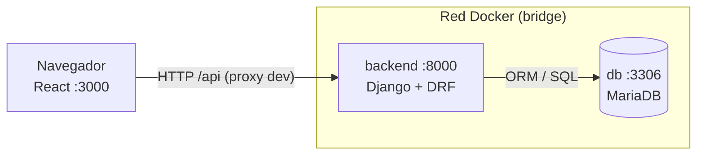
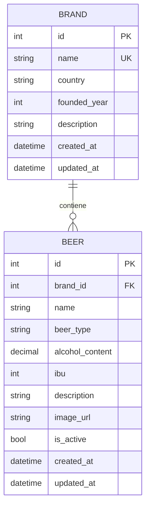

# Beer Manager

[](https://github.com/AmpolStack/beer-manager-django-react/actions/workflows/backend-tests.yml)

Aplicación CRUD para administrar marcas de cerveza y sus cervezas asociadas. Proyecto de
referencia que integra Django REST Framework, React y MariaDB, orquestados con Docker
Compose.

El objetivo del repositorio es mostrar una arquitectura completa y funcional en tres capas
(API, interfaz y base de datos) con la menor cantidad de código posible, siguiendo las
convenciones de cada tecnología.

## Contenido

1. [Stack tecnológico](#stack-tecnológico)
2. [Arquitectura](#arquitectura)
3. [Estructura del proyecto](#estructura-del-proyecto)
4. [Modelo de datos](#modelo-de-datos)
5. [Referencia de la API](#referencia-de-la-api)
6. [Backend: Django y DRF](#backend-django-y-drf)
7. [Frontend: React](#frontend-react)
8. [Infraestructura: Docker](#infraestructura-docker)
9. [Ciclo de vida de una petición](#ciclo-de-vida-de-una-petición)
10. [Puesta en marcha](#puesta-en-marcha)
11. [Tests](#tests)
12. [Tareas comunes](#tareas-comunes)
13. [Solución de problemas](#solución-de-problemas)
14. [Notas de producción](#notas-de-producción)
15. [Recursos](#recursos)

---

## Stack tecnológico

| Capa | Tecnología | Versión | Rol |
|------|-----------|---------|-----|
| API | Django | 5.0.6 | Framework web y ORM |
| API | Django REST Framework | 3.15 | Serialización, ViewSets, paginación |
| API | django-filter | 24.2 | Filtrado por query params |
| API | mysqlclient | 2.2.4 | Driver nativo MySQL/MariaDB |
| API | django-cors-headers | 4.4.0 | Cabeceras CORS para desarrollo |
| API | python-decouple | 3.8 | Lectura de variables de entorno |
| API | gunicorn | 22.0.0 | Servidor WSGI para producción |
| UI | React | 18 | Componentes y estado |
| UI | axios | 1.x | Cliente HTTP |
| UI | react-scripts (CRA) | 5.x | Build y dev server |
| DB | MariaDB | 11 | Base de datos relacional |
| Infra | Docker Compose | v2 | Orquestación de servicios |

---

## Arquitectura



El sistema tiene tres servicios independientes:

- **`frontend`** — aplicación React servida por el dev server de CRA en el puerto `3000`.
  No accede a la base de datos; solo consume la API.
- **`backend`** — proyecto Django que expone una API REST bajo `/api`. Toda la lógica de
  negocio, validación y acceso a datos vive aquí.
- **`db`** — instancia de MariaDB. Solo es accesible desde la red interna de Docker.

En desarrollo, el dev server de React actúa como proxy de `/api` hacia `backend:8000`, de
modo que el navegador ve un único origen y no hay CORS. La aplicación también soporta el
modo directo (`REACT_APP_API_URL=http://localhost:8000/api`), para el cual
`django-cors-headers` está configurado.

---

## Estructura del proyecto

```
beer-project/
├── docker-compose.yml
├── README.md
├── backend/
│   ├── Dockerfile
│   ├── requirements.txt
│   ├── manage.py
│   ├── beer_project/            # configuración del proyecto
│   │   ├── settings.py
│   │   ├── urls.py
│   │   └── wsgi.py
│   └── beers/                   # app de dominio
│       ├── models.py
│       ├── serializers.py
│       ├── views.py
│       ├── urls.py
│       ├── admin.py
│       ├── apps.py
│       ├── migrations/
│       └── management/commands/seed_beers.py
└── frontend/
    ├── Dockerfile
    ├── package.json
    ├── public/index.html
    └── src/
        ├── index.js
        ├── App.js
        ├── api.js
        ├── index.css
        └── components/
            ├── BeerList.js
            └── BrandList.js
```

La separación `beer_project/` (configuración) y `beers/` (dominio) es la convención de
Django: la configuración del proyecto no contiene lógica de negocio.

---

## Modelo de datos



- Una **marca** tiene muchas **cervezas** (`1:N`).
- La relación se implementa con una `ForeignKey` en `Beer` y `related_name='beers'`.
- `on_delete=models.CASCADE` elimina las cervezas cuando se borra su marca. Las
  alternativas son `PROTECT` (impide el borrado) y `SET_NULL`.
- `created_at` y `updated_at` se gestionan automáticamente con `auto_now_add` y `auto_now`.
- `beer_type` se restringe a un conjunto de valores mediante `choices`.

---

## Referencia de la API

Base URL: `http://localhost:8000/api`. Los listados son paginados (20 por página):

```json
{
  "count": 12,
  "next": null,
  "previous": null,
  "results": [{ "id": 1, "name": "...", "...": "..." }]
}
```

### Marcas

| Método | Endpoint | Descripción |
|--------|----------|-------------|
| GET | `/api/brands/` | Listar. Params: `search`, `ordering`, `page` |
| POST | `/api/brands/` | Crear |
| GET | `/api/brands/{id}/` | Obtener una |
| PUT | `/api/brands/{id}/` | Actualizar completa |
| PATCH | `/api/brands/{id}/` | Actualizar parcial |
| DELETE | `/api/brands/{id}/` | Eliminar (cascade a cervezas) |
| GET | `/api/brands/{id}/beers/` | Cervezas de esa marca |

### Cervezas

| Método | Endpoint | Descripción |
|--------|----------|-------------|
| GET | `/api/beers/` | Listar. Params: `brand`, `beer_type`, `is_active`, `search`, `ordering` |
| POST | `/api/beers/` | Crear |
| GET | `/api/beers/{id}/` | Obtener una |
| PUT / PATCH | `/api/beers/{id}/` | Actualizar |
| DELETE | `/api/beers/{id}/` | Eliminar |
| GET | `/api/beers/types/` | Tipos válidos para el `<select>` |

### Ejemplos

```bash
# Listar marcas
curl http://localhost:8000/api/brands/

# Crear marca
curl -X POST http://localhost:8000/api/brands/ \
  -H "Content-Type: application/json" \
  -d '{"name":"Asahi","country":"Japón","founded_year":1889}'

# Crear cerveza
curl -X POST http://localhost:8000/api/beers/ \
  -H "Content-Type: application/json" \
  -d '{
    "name": "Asahi Super Dry",
    "brand": 1,
    "beer_type": "lager",
    "alcohol_content": "5.00",
    "ibu": 15,
    "description": "Lager japonesa ligera y refrescante."
  }'

# Filtrar por tipo y ordenar por IBU descendente
curl "http://localhost:8000/api/beers/?beer_type=ipa&ordering=-ibu"

# Buscar
curl "http://localhost:8000/api/brands/?search=corr"

# Eliminar
curl -X DELETE http://localhost:8000/api/beers/13/
```

---

## Backend: Django y DRF

### Patrón MTV

Django organiza la lógica en tres capas:

- **Model** — define las entidades y el esquema de la base de datos. El ORM traduce entre
  objetos Python y filas SQL.
- **View** — produce la respuesta. En una API REST devuelve JSON.
- **Template** — HTML renderizado en servidor. No se usa en este proyecto; la interfaz es
  React.

### El ORM

Los modelos se declaran en `beers/models.py` y Django genera el esquema:

```python
class Beer(models.Model):
    name = models.CharField(max_length=100, verbose_name="Nombre")
    brand = models.ForeignKey(
        Brand,
        on_delete=models.CASCADE,
        related_name='beers',
        verbose_name="Marca",
    )
    alcohol_content = models.DecimalField(max_digits=4, decimal_places=2)
    created_at = models.DateTimeField(auto_now_add=True)
    updated_at = models.DateTimeField(auto_now=True)
```

Las consultas se construyen con QuerySets, que son perezosos (`lazy`) e inmutables: cada
llamada devuelve uno nuevo y la SQL se ejecuta solo al materializar los resultados.

```python
Beer.objects.all()                                    # SELECT * FROM beers_beer
Beer.objects.filter(beer_type='ipa')                  # WHERE beer_type = 'ipa'
Beer.objects.filter(is_active=True).order_by('-ibu')  # ORDER BY ibu DESC
Brand.objects.annotate(beers_count=Count('beers'))    # LEFT JOIN + GROUP BY
```

`select_related('brand')` resuelve la relación en un solo `JOIN` en lugar de `1 + N`
consultas. Es la optimización principal para evitar el problema N+1.

### Migraciones

Los cambios de esquema se versionan como archivos Python dentro de `beers/migrations/`:

```bash
python manage.py makemigrations   # compara modelos y genera el archivo
python manage.py migrate          # aplica los cambios pendientes a la base de datos
```

`makemigrations` produce el diff del esquema; `migrate` lo aplica. Los archivos generados
se incluyen en el control de versiones.

### Serializers

Los serializers definen el contrato de la API: qué campos entran y salen, y cómo se
validan.

```python
class BeerSerializer(serializers.ModelSerializer):
    brand_name = serializers.CharField(source='brand.name', read_only=True)

    class Meta:
        model = Beer
        fields = ['id', 'name', 'brand', 'brand_name', 'alcohol_content', '...']

    def validate_alcohol_content(self, value):
        if value < 0 or value > 100:
            raise serializers.ValidationError("El contenido de alcohol debe estar entre 0 y 100.")
        return value
```

`source='brand.name'` expone un campo anidado de forma plana; `read_only=True` lo hace de
solo lectura. Las validaciones por campo se implementan con métodos `validate_<campo>`.

### ViewSets y router

Un `ModelViewSet` genera el CRUD completo a partir de dos atributos:

```python
class BeerViewSet(viewsets.ModelViewSet):
    queryset = Beer.objects.select_related('brand').all()
    serializer_class = BeerSerializer
    filterset_fields = ['brand', 'beer_type', 'is_active']
    search_fields = ['name', 'brand__name', 'description']
    ordering_fields = ['name', 'alcohol_content', 'ibu']
```

| Método | Ruta | Acción |
|--------|------|--------|
| GET | `/api/beers/` | Listar (paginado) |
| POST | `/api/beers/` | Crear |
| GET | `/api/beers/{id}/` | Obtener |
| PUT | `/api/beers/{id}/` | Actualizar completo |
| PATCH | `/api/beers/{id}/` | Actualizar parcial |
| DELETE | `/api/beers/{id}/` | Eliminar |

Los filtros, la búsqueda y el ordenamiento se habilitan declarando atributos:

- `filterset_fields` — filtros exactos vía `django-filter` (`?beer_type=ipa`).
- `search_fields` — búsqueda `icontains` combinada con OR (`?search=guin`).
- `ordering_fields` — ordenamiento por campo (`?ordering=-ibu`).

Se pueden declarar acciones adicionales con `@action`:

```python
@action(detail=False, methods=['get'])
def types(self, request):
    return Response([{'value': 'ipa', 'label': 'IPA'}, ...])
```

`detail=False` define una acción de colección; `detail=True`, una acción sobre un objeto.

El `DefaultRouter` conecta las clases con las rutas:

```python
router = DefaultRouter()
router.register(r'brands', BrandViewSet, basename='brand')
router.register(r'beers', BeerViewSet, basename='beer')
```

### Configuración

La configuración vive en `beer_project/settings.py`. `python-decouple` lee las variables de
entorno con valores por defecto, de modo que el mismo código funciona en local y en Docker:

```python
DEBUG = config('DEBUG', default=True, cast=bool)
DB_HOST = config('DB_HOST', default='localhost')

DATABASES = {
    'default': {
        'ENGINE': 'django.db.backends.mysql',
        'NAME': config('DB_NAME', default='beer_db'),
        'HOST': DB_HOST,
        # ...
    }
}
```

### Panel de administración

Django incluye un panel de administración listo para usar. Declarando las opciones de
visualización en `beers/admin.py` se obtiene búsqueda, filtros y paginación sin escribir
vistas:

```python
@admin.register(Beer)
class BeerAdmin(admin.ModelAdmin):
    list_display = ['name', 'brand', 'beer_type', 'alcohol_content', 'ibu', 'is_active']
    list_filter = ['brand', 'beer_type', 'is_active']
    search_fields = ['name', 'brand__name', 'description']
```

Disponible en `http://localhost:8000/admin/`.

### Comando de datos de ejemplo

`beers/management/commands/seed_beers.py` define un comando de consola que carga un
conjunto inicial de marcas y cervezas. Se ejecuta con
`python manage.py seed_beers` y acepta `--empty` para limpiar los datos.

---

## Frontend: React

### Componentes

Un componente es una función que devuelve JSX. No hay clases ni decoradores.

```jsx
function BeerList() {
  return <div>Hola</div>;
}
```

JSX es HTML con expresiones JavaScript entre llaves:

- `className` en lugar de `class`.
- `onClick={handler}` para eventos.
- `{expresión}` para interpolar valores.
- `key` obligatorio en cada elemento de una lista, para que React identifique los ítems al
  reordenar.

### Estado y efectos

El estado local se declara con `useState` y los efectos con `useEffect`.

```jsx
const [beers, setBeers] = useState([]);
const [loading, setLoading] = useState(true);

setBeers(data.results);   // dispara un re-render
```

Reglas:

- No se actualiza el estado directamente durante el render.
- Los hooks se declaran siempre en el mismo orden.

```jsx
useEffect(() => {
  beerApi.getTypes().then(({ data }) => setTypes(data));
}, []);
```

El segundo argumento es el arreglo de dependencias:

- `[]` — se ejecuta una vez al montar.
- `[search, brand]` — se re-ejecuta cuando cambia alguna dependencia.
- Sin arreglo — se ejecuta en cada render.

Una función de limpieza permite cancelar peticiones o temporizadores:

```jsx
useEffect(() => {
  const t = setTimeout(loadBeers, 300);
  return () => clearTimeout(t);
}, [loadBeers]);
```

Ese patrón implementa el debounce del buscador.

`useCallback` estabiliza la referencia de una función entre renders; `useMemo` hace lo
mismo con un valor calculado. Sin `useCallback`, una función recreada en cada render
re-dispara el `useEffect` que la depende, provocando un bucle de peticiones.

### Flujo de datos

El flujo es unidireccional y siempre pasa por el estado:

```
state → render (JSX) → DOM → evento → setState → render
```

Nunca se muta el DOM directamente. Los campos controlados combinan `value` y `onChange`:

```jsx
<input value={form.name} onChange={e => setForm({ ...form, name: e.target.value })} />
```

### Props

Los props son los parámetros del componente y se pasan del padre al hijo por destructuración:

```jsx
function BeerForm({ beer, brands, onClose, onSaved }) { ... }
```

Las funciones recibidas como prop actúan como callbacks hacia el padre.

### Capa de acceso a datos

`src/api.js` centraliza todo el acceso HTTP. Ningún componente llama a `fetch` o `axios`
directamente:

```js
const API_BASE_URL = process.env.REACT_APP_API_URL || '/api';
const api = axios.create({ baseURL: API_BASE_URL });

export const beerApi = {
  list: (params) => api.get('/beers/', { params }),
  create: (data) => api.post('/beers/', data),
  delete: (id) => api.delete(`/beers/${id}/`),
};
```

Las peticiones `GET` devuelven un objeto paginado; por eso se usa `data.results || data`
para soportar ambos formatos.

### Organización

```
src/
├── index.js          # punto de entrada, monta React en el DOM
├── App.js            # componente raíz, controla la pestaña activa
├── api.js            # capa única de acceso HTTP
├── index.css         # estilos globales
└── components/
    ├── BeerList.js   # listado y formulario de cervezas
    └── BrandList.js  # listado y formulario de marcas
```

El proyecto usa Create React App por simplicidad. Para proyectos nuevos se recomienda Vite;
los conceptos de React (componentes, hooks, estado) son idénticos y solo cambia el tooling.

---

## Infraestructura: Docker

### Dockerfile

Cada servicio define su imagen a partir de un `Dockerfile`.

```dockerfile
FROM python:3.12-slim

WORKDIR /app

COPY requirements.txt .
RUN pip install -r requirements.txt

COPY . .

EXPOSE 8000
```

Copiar `requirements.txt` antes que el código permite que Docker reutilice la capa de
`pip install` cuando solo cambia el código fuente. El frontend usa la forma exec
(`CMD ["npm", "start"]`) para que el proceso reciba las señales del sistema directamente.

### docker-compose.yml

```yaml
services:
  db:
    image: mariadb:11
    environment:
      MYSQL_DATABASE: beer_db
      # ...
    healthcheck:
      test: ["CMD", "healthcheck.sh", "--connect", "--innodb_initialized"]
      retries: 5
      start_period: 30s
    volumes:
      - db_data:/var/lib/mysql

  backend:
    build: ./backend
    environment:
      DB_HOST: db
      ALLOWED_HOSTS: "localhost,127.0.0.1,0.0.0.0,backend"
    depends_on:
      db:
        condition: service_healthy
    volumes:
      - ./backend:/app
    command: >
      sh -c "python manage.py migrate && python manage.py runserver 0.0.0.0:8000"

  frontend:
    build: ./frontend
    ports:
      - "3000:3000"
    volumes:
      - ./frontend:/app
      - /app/node_modules
    depends_on:
      - backend

volumes:
  db_data:
```

Conceptos clave:

1. **Resolución por nombre de servicio.** `DB_HOST: db` funciona porque Docker crea una red
   donde `db` resuelve a la IP del contenedor. Dentro de un contenedor, `localhost` apunta
   al propio contenedor.
2. **`depends_on` con `condition: service_healthy`.** `depends_on` simple solo espera el
   arranque; el healthcheck garantiza que MariaDB esté lista antes de que Django conecte.
3. **Volúmenes de código.** `./backend:/app` monta el código local dentro del contenedor y
   habilita la recarga automática. El volumen anónimo `/app/node_modules` evita que los
   binarios nativos del host sustituyan los del contenedor.
4. **Volumen de datos.** `db_data` persiste la base de datos fuera del ciclo de vida de los
   contenedores.
5. **`0.0.0.0:8000`.** Un servidor dentro de un contenedor debe escuchar en todas las
   interfaces para aceptar conexiones externas.
6. **`ALLOWED_HOSTS`.** Cuando el proxy envía `Host: backend:8000`, Django debe tener
   `backend` en `ALLOWED_HOSTS` o responde `400 DisallowedHost`.
7. **Healthcheck de MariaDB.** La imagen `mariadb:11` no incluye `mysqladmin`; el script
   soportado es `healthcheck.sh --connect --innodb_initialized`.

---

## Ciclo de vida de una petición

Ejemplo: el usuario crea una cerveza desde el formulario.

1. **Formulario.** `BeerList.js` captura el `submit`, evita el comportamiento por defecto y
   llama a `handleSubmit`.
2. **Payload.** `handleSubmit` arma el objeto y convierte los valores numéricos de texto a
   número.
3. **Petición.** `api.js` ejecuta `POST /api/beers/`. El dev server de React la proxea a
   `backend:8000`.
4. **Ruteo.** `beer_project/urls.py` incluye `beers.urls`; el router dirige la petición a
   `BeerViewSet.create()`.
5. **Validación.** `BeerSerializer` verifica campos requeridos, rangos y claves foráneas.
   Si algo falla, devuelve `400` con el detalle por campo, que el frontend muestra en el
   formulario.
6. **Persistencia.** `serializer.save()` ejecuta el `INSERT` correspondiente a través del
   ORM.
7. **Respuesta.** La API devuelve `201 Created` con el objeto serializado.
8. **Actualización de la UI.** El callback `onSaved` cierra el formulario y recarga el
   listado; `setBeers` dispara el re-render.

El frontend nunca accede a la base de datos y el backend nunca manipula el DOM. El
serializer es la frontera que valida y traduce en ambas direcciones.

---

## Puesta en marcha

Requisito: Docker Desktop en ejecución.

```bash
cd beer-project
docker compose up --build
```

Servicios disponibles:

| Servicio | URL |
|----------|-----|
| Frontend | http://localhost:3000 |
| API | http://localhost:8000/api/ |
| Administración | http://localhost:8000/admin/ |
| MariaDB | `localhost:3306` |

Cargar datos de ejemplo y crear un usuario administrador:

```bash
docker compose exec backend python manage.py seed_beers
docker compose exec backend python manage.py createsuperuser
```

`seed_beers` carga 5 marcas y 12 cervezas. Para limpiar los datos:
`python manage.py seed_beers --empty`.

Detener y limpiar:

```bash
docker compose stop      # detiene los contenedores, conserva datos
docker compose down      # elimina los contenedores, conserva datos
docker compose down -v   # elimina contenedores y volumen de datos
```

---

## Tests

La suite usa el framework de pruebas nativo de Django (`django.test`) y cubre modelos,
serializers y la API. Corre contra una base SQLite en memoria definida en
`beer_project/settings_test.py`, así que es rápida y no necesita el servicio de MariaDB.

```bash
# Ejecutar la suite
docker compose exec backend python manage.py test --settings=beer_project.settings_test

# Con detalle de cada prueba
docker compose exec backend python manage.py test --settings=beer_project.settings_test -v 2

# Solo una clase
docker compose exec backend python manage.py test beers.tests.BeerAPITests
```

| Clase | Qué verifica |
|-------|--------------|
| `BrandModelTests` | Nombre único, `__str__`, borrado en cascada |
| `BeerModelTests` | Valores por defecto, `__str__`, `related_name` |
| `BrandAPITests` | Listado paginado, alta, validación, búsqueda, acción `beers`, borrado |
| `BeerAPITests` | CRUD, filtros, búsqueda, ordenamiento, acción `types` |
| `BeerSerializerTests` | Validación de `alcohol_content` e `ibu` |

### Integración continua

El workflow `.github/workflows/backend-tests.yml` ejecuta la suite en cada push a `main` y
en cada pull request. Antes de los tests corre dos verificaciones:

- `python manage.py check` — valida la configuración del proyecto.
- `python manage.py makemigrations --check --dry-run` — falla si hay cambios en los modelos
  sin una migración generada.

El badge al inicio del documento refleja el estado de la última ejecución.

---

## Tareas comunes

### Cambiar un campo del modelo

El orden de cambios sigue el flujo Model → Migración → Serializer → Frontend:

1. Agregar el campo en `beers/models.py` y ejecutar `makemigrations` y `migrate`.
2. Incluirlo en `BeerSerializer.Meta.fields`.
3. Agregarlo al formulario y a la tabla en `BeerList.js`.
4. Si se accede por el panel, incluirlo en `BeerAdmin`.

Omitir el serializer hace que el campo exista en la base de datos pero no viaje por la API.

### Agregar un campo calculado

```python
class BrandSerializer(serializers.ModelSerializer):
    beers_count = serializers.IntegerField(read_only=True)
```

Con la anotación correspondiente en el viewset:

```python
queryset = Brand.objects.annotate(beers_count=Count('beers'))
```

El valor se calcula en SQL y no existe como columna.

### Agregar un endpoint

```python
@action(detail=True, methods=['get'])
def similares(self, request, pk=None):
    beer = self.get_object()
    beers = Beer.objects.filter(beer_type=beer.beer_type).exclude(id=beer.id)[:5]
    return Response(BeerSerializer(beers, many=True).data)
```

Queda disponible en `GET /api/beers/{id}/similares/` sin modificar `urls.py`.

### Comandos de Django

```bash
docker compose exec backend python manage.py migrate
docker compose exec backend python manage.py makemigrations
docker compose exec backend python manage.py shell
docker compose exec backend python manage.py check
docker compose exec backend python manage.py showmigrations
```

---

## Solución de problemas

| Síntoma | Causa | Solución |
|---------|-------|----------|
| `Can't connect to MySQL server` | MariaDB no está lista o el host es incorrecto | Verificar `DB_HOST: db` (no `localhost`) |
| `Access denied for user` | Credenciales desalineadas | Revisar `db.environment` en compose |
| `CORS error` en consola | El frontend llama directo sin proxy | Usar `/api` (proxy) o agregar el origen a `CORS_ALLOWED_ORIGINS` |
| Un `.py` no se refleja | El volumen no está montado | Revisar `volumes: - ./backend:/app` |
| `Unknown field` en el serializer | El campo no existe en el modelo | Volver a `models.py` y migrar |
| Una app nueva no se carga | Falta en `INSTALLED_APPS` | Agregarla en `settings.py` |
| Errores en `node_modules` | Binarios de Windows montados en Linux | Mantener el volumen anónimo `/app/node_modules` |
| Pantalla en blanco | Error en el navegador | Revisar la consola y que la API responda |
| `400` al abrir `/api/` | El proxy envía `Host: backend:8000` | Agregar `backend` a `ALLOWED_HOSTS` |
| `500` con `no such table` | Faltan migraciones | `python manage.py makemigrations beers && python manage.py migrate` |
| DB `unhealthy` | Healthcheck con `mysqladmin` | Usar `["CMD", "healthcheck.sh", "--connect", "--innodb_initialized"]` |
| `Cannot GET /api/...` en un cliente | El dev server de CRA no proxea peticiones de navegación | Usar `curl -H "Accept: application/json"` |

---

## Notas de producción

Este repositorio es un prototipo. Antes de desplegarlo conviene revisar:

| Tema | Ahora | Producción |
|------|-------|------------|
| `DEBUG` | `True` | `False` y `ALLOWED_HOSTS` con el dominio real |
| `SECRET_KEY` | En el código | Variable de entorno o gestor de secretos |
| CORS | `localhost:3000` | Solo el dominio real |
| Servidor | `runserver` | Gunicorn (`gunicorn beer_project.wsgi:application --workers 4 --bind 0.0.0.0:8000`) |
| Archivos estáticos | Dev server | Nginx o WhiteNoise |
| Frontend | `npm start` | `npm run build` servido por Nginx |
| Migraciones | En cada `up` | Solo en el pipeline de despliegue |

### Autenticación

La API está abierta de forma intencional para mostrar el CRUD sin ruido. En un sistema real
se necesita JWT o sesiones (`djangorestframework-simplejwt`), permisos
(`permissions = [IsAuthenticated]`) y límites de tasa.

### Decisiones de diseño

- **Un único serializer por recurso.** `ModelSerializer` usa el modelo como contrato de
  entrada y salida. En sistemas complejos conviene separar los serializers de lectura y
  escritura.
- **El ORM como capa de acceso a datos.** No hay repositorios. Para lógica reutilizable se
  puede extraer un módulo `beers/services.py`.
- **Pruebas sobre SQLite.** La suite cubre modelos, serializers y endpoints, pero no
  ejercita la base de datos real de producción. Para cubrir diferencias de motor conviene
  añadir una ejecución contra MariaDB.
- **CORS y proxy como patrón de desarrollo.** En producción el reverse proxy sirve la API
  en el mismo origen y CORS deja de ser necesario.

---

## Recursos

| Recurso | Tema |
|---------|------|
| [Tutorial oficial de Django](https://docs.djangoproject.com/es/5.0/intro/tutorial01/) | Fundamentos del framework |
| [Modelos de Django](https://docs.djangoproject.com/es/5.0/topics/db/models/) | ORM en profundidad |
| [Django REST Framework](https://www.django-rest-framework.org/) | API, serializers y ViewSets |
| [React: documentación oficial](https://react.dev/learn) | Componentes, hooks y estado |
| [Pensar en React](https://react.dev/learn/thinking-in-react) | Estructura de componentes |
| [Vite](https://vite.dev/guide/) | Alternativa moderna a CRA |
| [Docker Compose](https://docs.docker.com/compose/) | Orquestación de servicios |
